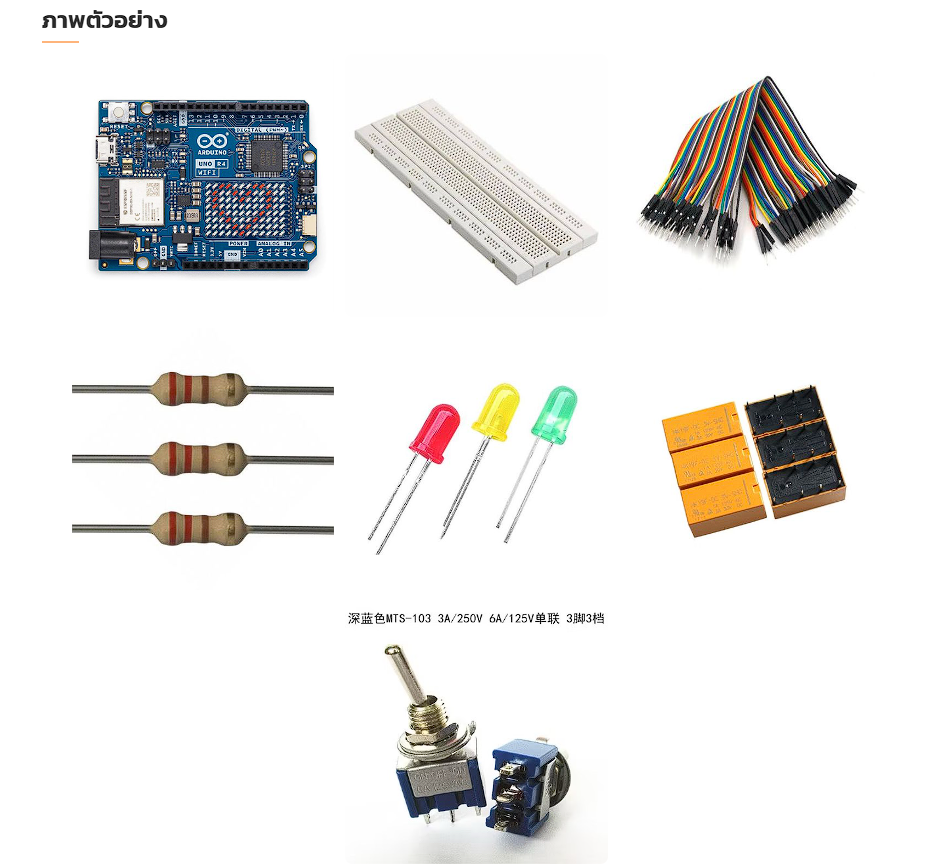

# Physical_computing :star2:	

## [WEBPAGE ของโครงงาน](https://wathasin2547.github.io/Physical_computing/)
## [VIDEO DEMO](https://www.youtube.com/watch?v=b7bGTxSVTHw&t=4s)

## วัตถุประสงค์ของโครงงาน

  - เพื่อออกแบบและสร้างสัญญาณไฟจราจรจำลอง
    สร้างวงจรที่จำลองสัญญาณไฟจราจรทั้ง 3 สี (แดง เหลือง เขียว) และสลับการทำงานตามระยะเวลาที่ตั้งค่าไว้

  - เพื่อพัฒนาทักษะการเขียนโค้ดในการควบคุม LED ด้วย Arduino R4
    เขียนโปรแกรมให้ Arduino R4 ควบคุม LED และสลับการทำงานตามลำดับสีและระยะเวลาเหมือนกับสัญญาณไฟจราจรจริง

  - เพื่อฝึกการวิเคราะห์และแก้ไขปัญหาการทำงานของวงจร
    ตรวจสอบและแก้ไขปัญหาที่อาจเกิดขึ้นระหว่างการต่อวงจรและการทำงานของระบบ เช่น การหน่วงเวลา การเชื่อมต่อระหว่างไฟ LED และ Arduino

## ประโยชน์ของโครงงาน

  - ศึกษาและเข้าใจระบบการทำงานของสัญญาณไฟจราจร
    ผู้เรียนสามารถเข้าใจการทำงานของไฟจราจรและการสลับสีไฟตามระยะเวลาที่กำหนด รวมถึงผลกระทบของสัญญาณต่อการควบคุมการจราจร

  - พัฒนาทักษะการเขียนโปรแกรมและการใช้ไมโครคอนโทรลเลอร์
    โครงงานนี้ช่วยเพิ่มทักษะการเขียนโปรแกรม โดยเฉพาะในการควบคุมไฟ LED และการตั้งค่าเวลาให้ Arduino R4 เพื่อแสดงสัญญาณไฟที่ถูกต้อง

  - นำความรู้ที่ได้ไปประยุกต์ใช้ในระบบการควบคุมอื่น ๆ
    การใช้ไมโครคอนโทรลเลอร์ในโครงงานนี้ช่วยให้เข้าใจหลักการทำงานของอุปกรณ์ไฟฟ้าแบบเรียลไทม์ ซึ่งสามารถต่อยอดไปใช้ในระบบควบคุมอัตโนมัติอื่น ๆ ได้

  - ฝึกการแก้ปัญหาและการทำงานอย่างมีแบบแผน
    การสร้างโครงงานนี้จะช่วยฝึกการออกแบบและต่อวงจร รวมถึงการแก้ปัญหาที่อาจเกิดขึ้น เช่น การตั้งเวลา การปรับการสลับสัญญาณไฟให้เหมาะสม

## รายละเอียด 

  การพัฒนาโครงการ 4 แยกไฟแดงด้วยการใช้ Relay เชื่อมกับ Arduino R4 เพื่อควบคุมไฟ LED มีขั้นตอนดังนี้:

  เตรียมอุปกรณ์
  - Arduino R4
  - Relay DPDT
  - LED สีแดง เขียว และเหลือง
  - Switch เปิด/ปิด
  - สายไฟและ Breadboard
  - ตัวต้านทาน 220Ω (หรือค่าที่เหมาะสม)

    
  
  สร้างวงจร
  - เชื่อมต่อ Relay กับ Arduino: ใช้พอร์ต Digital เพื่อควบคุมแต่ละ Relay
  (Relay DPDT (Double Pole Double Throw) เป็นรีเลย์ที่มีหน้าสัมผัสสองชุดและสามารถเปลี่ยนวงจรได้สองทิศทาง โดยจะมีรายละเอียดดังนี้ : 
  ขดลวดอยู่ระหว่างขั้ว 1 และ 16 โดยเมื่อมีแรงดันไฟฟ้าเข้ามายังขั้วนี้ ขดลวดจะสร้างสนามแม่เหล็กเพื่อดึงหน้าสัมผัสให้เปลี่ยนตำแหน่ง หน้าสัมผัสที่ 4 และ 13 จะเชื่อมกับขั้ว 6 และ 11 ตามลำดับในสภาวะปกติ (NC - Normally Closed) และจะเปลี่ยนไปเชื่อมกับขั้ว 8 และ 9 เมื่อขดลวดได้รับแรงดันไฟฟ้า (NO -       Normally Open))
  - เชื่อมต่อ LED กับ Relay: ใช้ Relay แต่ละตัวควบคุมการเปิด/ปิดของ LED แต่ละสี
  - เชื่อมต่อ Switch กับ Arduino: ใช้พอร์ต Digital เพื่อควบคุมการเปิด/ปิด 4 แยกไฟแดง 
  - ใช้ตัวต้านทานร่วมกับ LED: ต่อเข้าในวงจรเพื่อป้องกันไม่ให้ LED ได้รับแรงดันเกิน
  
  เขียนโปรแกรมใน Arduino IDE
  - ตั้งค่าขา Output Pins สำหรับควบคุม Relay และ Input Pin เพื่อรับค่าจาก Switch
  - เขียนลูปการทำงานของไฟจราจร โดยกำหนดระยะเวลาของไฟแต่ละสีตามลำดับ
  - ใช้คำสั่ง `digitalWrite` เพื่อเปิดและปิด Relay ตามลำดับของไฟแต่ละสี
  
  ทดสอบการทำงาน
  - **Upload โปรแกรมเข้าสู่ Arduino** แล้วตรวจสอบการทำงานของไฟแต่ละสีในลำดับตามที่กำหนดไว้
  - ปรับค่าของเวลาและลำดับการทำงานหากพบปัญหา 
  
  ปรับปรุงและบันทึกข้อมูล
  - ปรับปรุงการเชื่อมต่อหรือโค้ดตามที่ต้องการ
  - บันทึกโค้ดและผังวงจร

## สมาชิก
  1. วาทะศิลป์ ห้วยหงษ์ทอง รหัสนักศึกษา [66070183]
  2. พงศ์พศุตม์ บุญดี รหัสนักศึกษา [66070122]
  3. ศุภณัฐ งามเกตุสุข รหัสนักศึกษา [66070195]
  4. ภวินท์ แย้มเยื้อน รหัสนักศึกษา [66070144]

